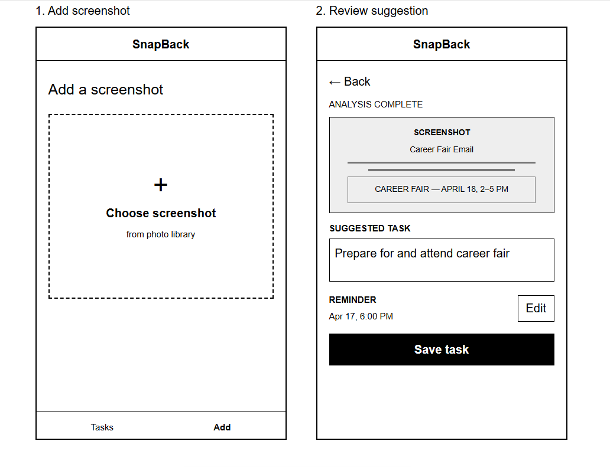
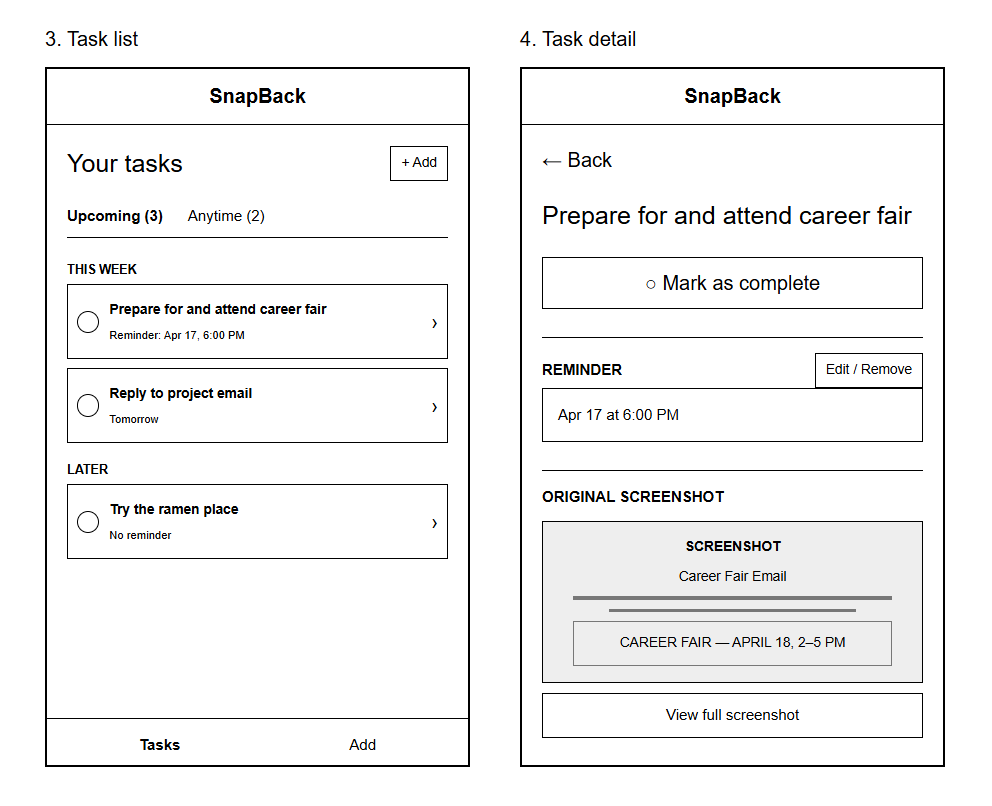

# Design Document
## Problem Framing and Stakeholders
### Domain
The domain of the problem I want to address is using smartphone screenshots to save information that users intend to act on later. Phone users frequently come across information that may require a future action, whether it be an event they plan to attend, an item they want to buy, or a message that requires a response. Unlike saving information to a more specific destination, such as a calendar, reminder, or wishlist, taking a screenshot does not require the user to decide how the information should be organized or acted on. It allows both the information and the decision of what to do with it to be deferred until later.
However, the screenshot primarily preserves the content that was visible at the time it was taken. The reason the user saved that content, such as wanting to buy something, attend an event, or complete a task, may not be represented anywhere. Users therefore rely on returning to the screenshot and remembering the intention they had when they saved it.
### Bad situations
1. Users can miss time-sensitive actions when screenshots containing deadlines or events are not revisited in time.
A screenshot can preserve information about something that requires action by a particular time without creating any prompt for the user to act on it. For example, because emails can become buried among newer messages, I may screenshot an email that I need to respond to before a deadline. At the time, taking the screenshot feels like a quick way to make sure I do not lose the information. However, the screenshot can then become buried among newer photos and screenshots. If I do not remember to return to it, I may only encounter it again after the response deadline has passed. Similar situations can occur when users screenshot event announcements, application deadlines, ticket sales, or other information tied to a specific time. In these cases, the information itself has been successfully saved, but the opportunity to act on it can still be lost.
2. Users can indefinitely defer actions that do not have a clear deadline.
Not every intention attached to a screenshot is time-sensitive. A user might screenshot a pair of shoes they want to consider buying, a restaurant they want to visit, or something they want to try later. Because there is no deadline forcing them to return to the screenshot, it may remain in their photo library while newer screenshots continue to accumulate. The user may eventually rediscover it weeks or months later and realize that they never followed through on something they originally wanted to do. In this situation there may be no single missed deadline, but screenshotting makes it easy for an intended action to remain deferred indefinitely.
3. Users may recover a screenshot without recovering their original intention for saving it.
Even when users return to an old screenshot, its content may not completely explain why they saved it. For example, a user who finds an old screenshot of a restaurant may remember the restaurant but not whether they wanted to visit it, send it to a friend, or try a particular dish. The screenshot preserves what the user saw, but the semantic link between that information and the intended action can be lost over time. This can leave users with saved information that they no longer know how they intended to use.
### Corroboration
Research suggests that using screenshots to save information can make the saved information easier to forget. In The Cost of Saving: How Photos and Screenshots Impair Memory, three experiments compared participants' memory for images they photographed, viewed, and screenshotted. Participants consistently had worse memory for images they digitally saved than for those they only viewed. Screenshotting in particular had a negative effect on memory, despite requiring less effort than taking a photograph [1].
In the follow-up study Digital Amnesia: The Aftermath of a Screenshot, participants across seven experiments similarly demonstrated worse memory for screenshotted images than for images they only viewed [2]. A Binghamton University article discussing the research describes divided attention as one possible contributor: capturing something requires cognitive resources that could otherwise be used to encode the information. The researchers also discuss cognitive offloading, where people devote fewer cognitive resources to remembering information when they know it has been stored externally [3]. This connects to the bad situations above because users may rely on a screenshot to remember information later, even though nothing necessarily prompts them to return to it.
The article further states that screenshots can supplement memory when people intentionally save a limited number and review them afterward. In contrast, frequently taking screenshots and allowing them to accumulate without reviewing them can contribute to forgetting [3]. This is especially relevant when screenshots become buried among other photos, since they are only useful as an external memory aid if users actually return to them.
However, these sources do not directly establish how common it is for users to fail to act on information they have screenshotted. Further user studies would be needed to determine how frequently users miss time-sensitive actions, indefinitely defer intentions, or forget why they saved a screenshot in the first place.
Sources: [1](https://link.springer.com/article/10.3758/s13421-025-01711-2) [2](https://link.springer.com/article/10.3758/s13421-026-01921-2) [3](https://www.binghamton.edu/news/story/6397/digital-amnesia-taking-screenshots-makes-you-more-likely-to-forget-information)
### Workarounds and comparables
**Workaround 1: Purpose-specific tools**
One potential workaround is manually transferring information from screenshots into tools that help users follow through with their intended action, such as a reminder app, calendar, or wishlist. These tools can preserve information about what the user intends to do and, in some cases, when they intend to do it. However, they require users to take additional steps to categorize the information and decide what they want to do with it at the time they encounter it. This takes away from the convenience of screenshotting, which allows users to quickly save something without making those decisions right away.
**Workaround 2: Screenshot organization tools**
Another workaround is using an app designed specifically to organize screenshots. PicoJar, for example, automatically imported screenshots, allowed users to organize them using tags, and included reminders to review screenshots saved that week. While this gave users a reason to return to their screenshots, they still had to review them, determine how to organize them, and remember what they intended to do with the information. PicoJar therefore addressed the problem of returning to screenshots but did not eliminate the gap between saving information and determining what action should follow from it.
**Comparables**
Other systems demonstrate how semantic information can be extracted from screenshots. Microsoft's Recall, for example, captures snapshots of activity on a Windows PC and makes their content searchable, allowing users to retrieve information they previously encountered. Irchiver is another project exploring the organization and retrieval of information from screenshots. These systems show that screenshots can be understood and retrieved based on their content. However, my problem focuses more specifically on screenshots users intentionally take because they want to act on something later. Retrieving what was shown in a screenshot does not necessarily recover what the user intended to do with it.
### Solution sketch
My proposed solution is a web app that turns actionable screenshots into tasks and reminders. Users would import screenshots into the app, where AI would analyze the content of each screenshot and infer the user's likely intention behind saving it. Based on the information it identifies, the app would generate an editable task representing what the user may want to do. When relevant information such as a date or deadline is identified, the app would use it to create a reminder for the task.
Since the intention behind a screenshot may not always be clear from its content, users would be able to correct the AI's interpretation. These corrections could help improve suggestions for other users with similar screenshots. Rather than requiring users to manually reconstruct why they saved each screenshot, the app attempts to preserve the connection between the saved information and the action that may need to follow from it.
### Stakeholders
- Screenshot savers: Phone users who take screenshots of information they intend to act on later. They experience the primary problem and would use the app to recover and follow through on those intentions.
- Other app users: Users whose corrections to AI-generated tasks can improve how similar screenshots are interpreted for others. Their behavior makes the system collaborative even when users are not directly interacting with one another.
## Application Pitch
**SnapBack** helps users follow through on the things they screenshot for later. Screenshots make it easy to save something without immediately deciding what to do with it, but as screenshots accumulate, users can miss deadlines, indefinitely put off intended actions, or even forget why they saved something in the first place. SnapBack connects the information preserved in a screenshot with the action the user may have intended to take.
To do this, SnapBack has three key features that work together to move a screenshot from something passively saved into something actionable. **Screenshot-to-Task** allows users to import a screenshot, which AI analyzes to suggest what the user may have intended to do with it. For example, a concert announcement may become “Buy tickets for this concert,” while an email may become “Respond to this email.” The AI can also identify relevant information from the screenshot, such as an event date or deadline, to include with the suggested task. Since the same screenshot can represent different intentions to different people, users can edit or correct the suggestion. These corrections can also help improve suggestions for other users with similar screenshots in the future.
Once a task has been generated, **Task Management** allows users to view, edit, and complete their tasks in a to-do list. The original screenshot remains connected to its task so that users can return to the information that caused them to save it. Instead of having to search through their photo library and remember what they planned to do, users have a concrete action connected to the information they originally saved.
Finally, **Reminders** bring tasks back to users when they are relevant. If SnapBack identifies time-sensitive information such as an event date or deadline, it creates a reminder based on that information. Users can change the reminder time or remove the reminder if they do not need it. Together, these features preserve the convenience of taking a screenshot while helping users follow through on the reason they saved it in the first place.
## Concept specifications, essential reactions, + their roles
### Concept 1: ScreenshotStoring
```
concept ScreenshotStoring [User]
purpose
    allow users to preserve screenshots they want to return to
principle
    A user adds a screenshot, which remains stored for the user until
    they remove it.
state
    a set of Screenshots with
        an owner User
        an image Image
actions
    add (user: User, image: Image): (screenshot: Screenshot)
        where
            image is not already stored as a screenshot owned by user
        then
            create screenshot with owner user and image
            add screenshot to the set of Screenshots
    remove (user: User, screenshot: Screenshot)
        where
            screenshot is in the set of Screenshots
            screenshot has owner user
        then
            remove screenshot from the set of Screenshots
```
### Concept 2: IntentionInferring
```
concept IntentionInferring [User, Content]
purpose
    help users recover the action they intended to take from saved content
principle
    Content is analyzed to suggest an intended action and any relevant
    time information. A user can correct the suggestion when it does not
    match their intention, and corrections can inform future suggestions.
state
    a set of Inferences with
        a Content
        an intention String
        an optional time DateTime
    a set of Corrections with
        a User
        a Content
        an intention String
actions
    infer (content: Content): (inference: Inference)
        where
            content does not already have an inference
        then
            create inference for content with a suggested intention
            and relevant time if one is identified
            add inference to the set of Inferences
    correct (user: User, content: Content, intention: String)
        where
            an inference for content is in the set of Inferences
        then
            set the intention of the inference for content to intention
            create a correction with user, content, and intention
            add correction to the set of Corrections
```
### Concept 3: TaskTracking
```
concept TaskTracking [User, Source]
purpose
    allow users to keep track of actions they intend to complete
principle
    A user creates a task describing an action they intend to do.
    The task remains active until the user completes or removes it and
    can be edited while retaining its original source.
state
    a set of Tasks with
        an owner User
        a description String
        a Source
        a completed Boolean
actions
    create (user: User, description: String, source: Source): (task: Task)
        where
            description is not empty
        then
            create task with owner user, description, source,
            and completed set to false
            add task to the set of Tasks
    edit (user: User, task: Task, description: String)
        where
            task is in the set of Tasks
            task has owner user
            description is not empty
        then
            set description of task to description
    complete (user: User, task: Task)
        where
            task is in the set of Tasks
            task has owner user
            task has completed false
        then
            set completed of task to true
    remove (user: User, task: Task)
        where
            task is in the set of Tasks
            task has owner user
        then
            remove task from the set of Tasks
```
### Concept 4: Reminding
```
concept Reminding [User, Item]
purpose
    remind users about items at relevant future times
principle
    A reminder is created for an item at a suggested time.
    The user can change or cancel the reminder before it occurs,
    and is notified when the reminder time arrives.
state
    a set of Reminders with
        a recipient User
        an Item
        a time DateTime
actions
    create (user: User, item: Item, time: DateTime): (reminder: Reminder)
        where
            item does not already have a reminder for user at time
        then
            create reminder with recipient user, item, and time
            add reminder to the set of Reminders
    reschedule (user: User, reminder: Reminder, time: DateTime)
        where
            reminder is in the set of Reminders
            reminder has recipient user
        then
            set time of reminder to time
    cancel (user: User, reminder: Reminder)
        where
            reminder is in the set of Reminders
            reminder has recipient user
        then
            remove reminder from the set of Reminders
    notify (user: User, reminder: Reminder)
        where
            reminder is in the set of Reminders
            reminder has recipient user
            reminder time has arrived
        then
            notify user about the item in reminder
```
### Essential Reactions
Analyze a Newly Added Screenshot:
```
when
    ScreenshotStoring.add (user, image): (screenshot)
then
    IntentionInferring.infer (
        content: screenshot
    )
```
Create a Task from the Inferred Intention:
```
when
    IntentionInferring.infer (content): (inference)
where
    ScreenshotStoring: content is a screenshot owned by user
    IntentionInferring: inference has intention
then
    TaskTracking.create (
        user: user,
        description: intention,
        source: content
    )
```
Update the Task When the User Corrects the Inferred Intention:
```
when
    IntentionInferring.correct (user, content, intention)
where
    TaskTracking: task is in the set of Tasks
    TaskTracking: task has source content
    TaskTracking: task has owner user
then
    TaskTracking.edit (
        user: user,
        task: task,
        description: intention
    )
```
Create a Reminder When Time Information Is Found:
```
when
    TaskTracking.create (user, description, source): (task)
where
    IntentionInferring: source has an inference with time
then
    Reminding.create (
        user: user,
        item: task,
        time: time
    )
```
## Role of the Concepts
SnapBack uses four concepts to handle the different parts of turning a screenshot into something a user can act on. ScreenshotStoring keeps track of the screenshots a user uploads to the app. IntentionInferring looks at the content of a screenshot and suggests what the user may have intended to do with it, along with relevant time information such as an event date or deadline. If the suggestion is wrong, the user can correct it, and those corrections can help improve future suggestions for similar content.
TaskTracking keeps track of the tasks created from these suggestions and connects each task to the screenshot it came from. Reminding handles reminders for tasks when IntentionInferring finds relevant time information. SnapBack creates the initial reminder, but the user can change its time or remove it if the suggestion does not work for them.
In SnapBack, Content in IntentionInferring and Source in TaskTracking are both instantiated as screenshots from ScreenshotStoring. Item in Reminding is instantiated as a task from TaskTracking. Reactions connect these concepts so that adding a screenshot can lead to an inferred intention, a task, and, when relevant, a reminder without making any one concept responsible for the entire process.
## UI Sketches




## User Journey
A college student receives an email about an upcoming career fair they want to attend. The email includes the date and time of the event, but they are busy when they see it and do not want to stop what they are doing to add the event to their calendar. Instead, they take a screenshot of the email so they can return to it later. Normally, that screenshot could become buried in their photo library, causing them to forget about the event.

Later, the student opens SnapBack and uploads the screenshot. SnapBack analyzes the screenshot and infers the task "Attend career fair." It also identifies the date and time of the career fair from the email. Based on this information, SnapBack automatically creates the task and adds it to the student's task list, keeping it connected to the original screenshot. The student reviews the generated task and changes its description to "Prepare for and attend career fair" so that it better reflects what they intended to do when they took the screenshot.

Because SnapBack identified time-sensitive information in the screenshot, it also automatically creates a reminder for the task. The student reviews the reminder and can change its time or remove it if they do not want it. Before the career fair, the reminder brings the task back to the student's attention. They can open the task to see the original screenshot and refer back to the information in the email.

Instead of relying on themselves to remember that they took the screenshot, the student has a concrete task connected to the information they originally saved. SnapBack helps the student recover why they saved the screenshot and brings the intended action back to their attention while it is still useful.
